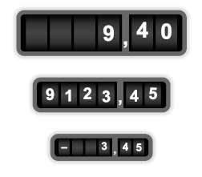

# A Wonky JavaScript Mechanical Counter

This is a vanilla-javascript mechanical counter with zero dependencies.



All you need is for the counter are the ``mechctr.js`` and ``mechctr.css`` files.


## Example Usage

```
let div = document.getElementById("my_div")
let counter = new MechanicalCounter(div, 4, 2, "audio")
counter.setValue(123.45)
```


## API

### Constructor

  ```
  MechanicalCounter(
      parentElement,          // DOM element to create the counter in
      digitsBeforeDecimal,    // number of digits left of the decimal point [integer]
      digitsAfterDecimal,     // number of digits right of the decimal point [integer]
      audioFilesPath,         // path to audio effect files [string]
      size,                   // [optional] counter size (0=big, 1=medium, 2=small), [integer]
      decimalPointCharacter,  // [optional] decimal point characteri, default is "," [char]
      wonkiness               // [optional] roller positioning accuracy, default=0.1 [float]
                              //            (0=perfectly accurate; 1=might be a whole digit off)
  )
  ```
  
### Setting counter value

  ```
  counter.setValue(
      value,                  // the value to show [number]
      jump                    // if true, do not animate the move, quietly set to the new value;
                              // otherwise, the counter will be animated and sound effects will be
                              // produced
  )
  ```


## Examples

Check the ``example.html`` and ``calculator.html`` files for examples.

To see the counter in action, visit http://avtanski.net/projects/calc


## Known issues

* In some browsers, audio requires user interaction with the page. This is a browser safety feature, not a bug.
* Audio does not work correctly in Safari.


## Contact

Alexander Avtanski, alex@avtanski.com


## License

2022 Alexander Avtanski <alex@avtanski.com>

This work is licensed under a Creative Commons Attribution 4.0 International License